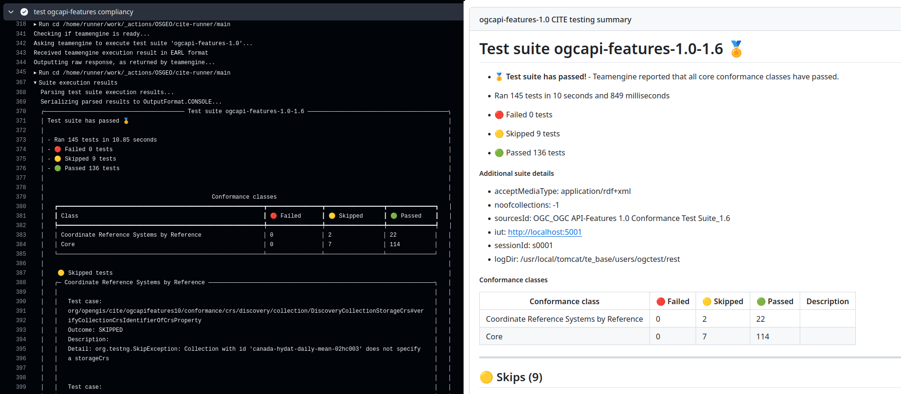
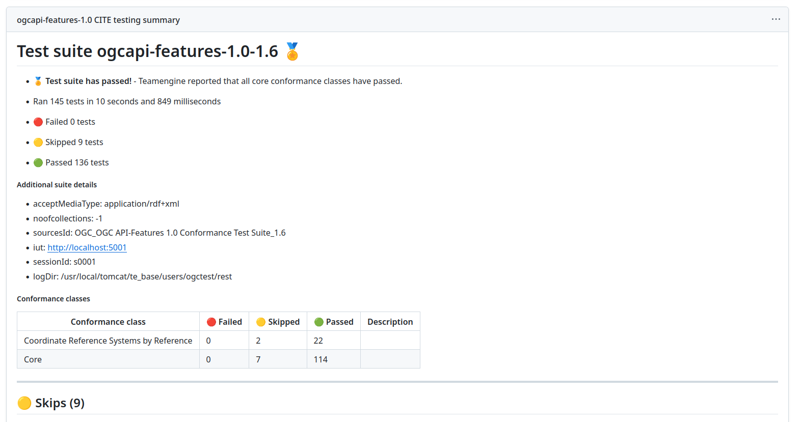
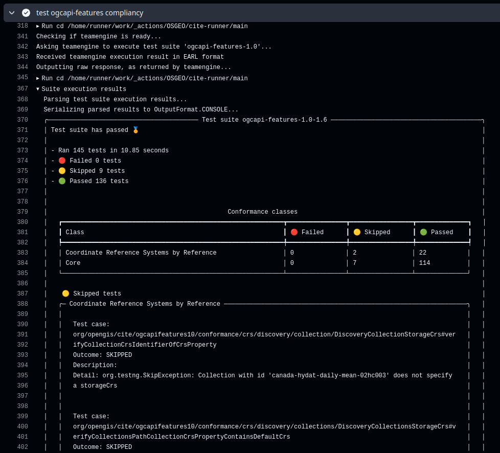

---
hide:
  - navigation
---

# Running as a github action



## Overview

In order to run cite-runner as a [github action], include it in your workflow
and specify which test suite to run, alongside any relevant parameters.


!!! tip

    Although cite-runner is not yet published in the [github marketplace] it
    can still be used in github CI workflows.

[github action]: https://docs.github.com/en/actions/sharing-automations/creating-actions/about-custom-actions
[github marketplace]: https://github.com/marketplace

Include it as any other github action, by creating a workflow step that
specifies `uses: OSGEO/cite-runner` and provide execution parameters in the
`with` parameter.

Here is a simple example usage:

```yaml
jobs:
  perform-cite-testing:
    runs-on: ubuntu-24.04
    steps:
      - name: test ogcapi-features compliancy
        uses: OSGEO/cite-runner@main
        with:
          test_suite_identifier: ogcapi-features-1.0
          test_session_arguments: >-
            iut=http://localhost:5001
            noofcollections=-1
```

## Inputs

When run as a github action, cite-runner expects the following inputs to be provided:


### `test_suite_identfier`

- **Required**: Yes
- **Description**: Identifier of the test suite to be executed. Test suite identifiers can be gotten from
  the [OGC Test suites section](ogc-test-suites.md).

    Example:

    ```yaml
    test_suite_identifier: 'ogcapi-features-1.0'
    ```


### `test_session_arguments`

- **Required**: Yes
- **Description**: Test session arguments to be passed to TeamEngine. These depend on the test
    suite that is going to be executed.

    Must be provided as a space-separated list of `key=value` pairs. Examples:

    - A simple yaml string
      ```yaml
      test_session_arguments: 'iut=http://localhost:5001 noofcollections=-1'
      ```

    - If you prefer to use a multiline string, then  we recommend use of YAML *folded blocks* with the _strip_
      chomping indicator (AKA put a dash after the folded block indicator, AKA this: `>-`)
      ```yaml
      test_session_arguments: >-
        iut=http://localhost:5001
        noofcollections=-1
      ```


### `teamengine_url`

- **Required**: No (defaults to not set)
- **Description**: URL of the TeamEngine instance to be used for running tests.

    If this parameter is not specified then the action will spin up a local
    TeamEngine docker container and use it for testing.

    When providing a value for this option, it can be used in conjunction with
    the `teamengine_username` and `teamengine_password` in order to provide
    authentication credentials.

    !!! note
        The value of `teamengine_url` must be the URL of the landing page of
        the TeamEngine service, which usually is located at the `/teamengine` path.

    Examples:

    - When you intend for the action to spin up a local docker instance there is
      no need to supply this argument. The action will run totally self-contained

    - When using the remote TeamEngine instance located at `https://my-server`
      with a pre-existing user `myself` and a password of `something`:

      ```yaml
      teamengine_url: 'https://my-server/teamengine'
      teamengine_username: 'myself'
      teamengine_password: 'something'
      ```


### `teamengine_username`

- **Required**: No (defaults to `ogctest`)
- **Description**: Username to be used when logging in to a remote TeamEngine instance.
  Defaults to `ogctest`, which is a user that is pre-created on the official TeamEngine docker image.


### `teamengine_password`

- **Required**: No (defaults to `ogctest`)
- **Description**: Password to be used when logging in to a remote TeamEngine instance.
  Defaults to `ogctest`, which is the password used for the pre-created user on the official TeamEngine docker image


### `network_timeout_seconds`

- **Required**: No (defaults to `120`)
- **Description**: Timeout value for network requests, in seconds


### `include_failed_test_details`

- **Required**: No (defaults to `true`)
- **Description**: Whether the output report should include information about failed tests


### `include_skipped_test_details`

- **Required**: No (defaults to `true`)
- **Description**: Whether the output report should include information about skipped tests


### `include_passed_test_details`

- **Required**: No (defaults to `false`)
- **Description**: Whether the output report should include information about passed tests


## Usage

The below examples define a GitHub workflow for testing pygeoapi.

Simple usage, running the `ogcapi-features-1.0` test suite whenever there is a `push`:

```yaml
on:
  push:

jobs:

  perform-cite-testing:
    runs-on: ubuntu-22.04
    steps:
      - name: grab code
        uses: actions/checkout@v4

      - name: start pygeoapi with suitable CITE data and config
        run: >
          docker compose -f tests/cite/compose.test-cite.yaml up --detach

      - name: wait for pygeoapi to be usable
        uses: raschmitt/wait-for-healthy-container@v1.0.1
        with:
          container-name: pygeoapi-cite-pygeoapi-1
          timeout: 120

      - name: test ogcapi-features compliancy
        uses: OSGEO/cite-runner@main
        with:
          test_suite_identifier: 'ogcapi-features-1.0'
          test_session_arguments: >-
            iut=http://localhost:5001
            noofcollections=-1
```

A slightly more complex example, using a matrix to test both `ogcapi-features-1.0`
and `ogcapi-processes-1.0` test suites in parallel:

```yaml
on:
  push:

env:
  COLUMNS: 120


jobs:

  perform-cite-testing:
    strategy:
      matrix:
        test-suite:
          - suite-id: ogcapi-features-1.0
            arguments: >-
              iut=http://localhost:5001
              noofcollections=-1
          - suite-id: ogcapi-processes-1.0
            arguments: >-
              iut=http://localhost:5001
              noofcollections=-1

    runs-on: ubuntu-22.04
    steps:

      - name: grab code
        uses: actions/checkout@v4

      - name: start pygeoapi with suitable CITE data and config
        run: >
          docker compose -f tests/cite/compose.test-cite.yaml up --detach

      - name: wait for pygeoapi to be usable
        uses: raschmitt/wait-for-healthy-container@v1.0.1
        with:
          container-name: pygeoapi-cite-pygeoapi-1
          timeout: 120

      - name: collect docker logs on failure
        if: failure()
        uses: jwalton/gh-docker-logs@v2.2.2
        with:
          images: ghcr.io/geopython/pygeoapi
          tail: 500

      - name: test ogcapi-features compliancy
        uses: OSGEO/cite-runner@main
        with:
          test_suite_identifier: ${{ matrix.test-suite.suite-id }}
          test_session_arguments: ${{ matrix.test-suite.arguments }}

```


## Results

The cite-runner github action stores both:

- Raw suite results, as output directly by OGC TeamEngine. This is an XML file that uses a schema based on the
  W3C EARL format
- Parsed suite results, in Markdown format.

These results are saved as [workflow artifacts] and are available for download for further processing.

Additionally, cite-runner also adds the contents of the parsed Markdown file as the job summary, making them directly
visible in the github workflow run overview page:



Furthermore, the full suite execution results are also shown in the job logs:



!!! note

    The parsed results which are persisted as a Markdown artifact and shown in the job summary respect
    the action parameters:

    - `include_failed_test_details`
    - `include_skipped_test_details`
    - `include_passed_test_details`

    However, the results shown on the job logs always include the full results.

[workflow artifacts]: https://docs.github.com/en/actions/writing-workflows/choosing-what-your-workflow-does/storing-and-sharing-data-from-a-workflow#about-workflow-artifacts
