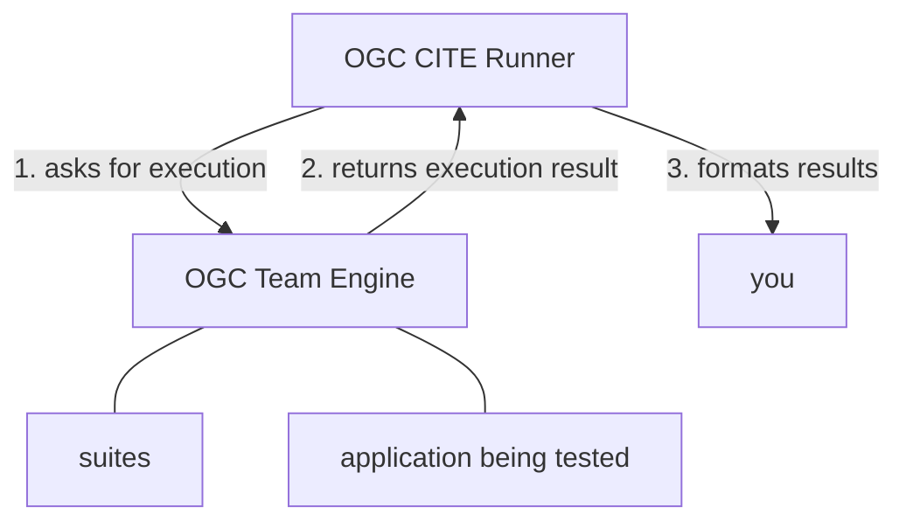

## OGC CITE Runner

A Pythonic convenience runner for OGC compliance testing

- Ricardo Garcia Silva <ricardo.garcia.silva@gmail.com>
- Tom Kralidis <tomkralidis@gmail.com>

[FOSS4G 2025](https://2025.foss4g.org)
---

## Outline

- OGC Standards and Compliance
- OGC CITE overview
- Introducing OGC CITE Runner
- Future work

---

## OGC Standards and Compliance

- Certified OGC Compliant: product has passed compliance testing
  - compliance matrix:
    - supported standard * product version
- Uncertified: product has implemented and registered

[ogc.org/how-our-compliance-program-works](https://www.ogc.org/how-our-compliance-program-works)

---

## OGC CITE overview

- Compliance & Interoperability Testing & Evaluation
- repository of conformance tests
- uses Test Evaluation And Measurement (TEAM) Engine (FOSS) as baseline
  - [OSGeo Community project](https://www.osgeo.org/projects/teamengine)
- Executable Test Suites (ETS) are developed foreach OGC standard

-v-

## OGC CITE overview

- CITE is typically run as an interactive web service
  - [cite.opengeospatial.org/teamengine](https://cite.opengeospatial.org/teamengine)
- Docker: supports containerized/local build/invocation

-v-

## Value proposition for further automation of OGC CITE

- use by any project looking for automated lower barrier CITE testing
- CI/CD workflows
  - schedule
  - on commit/push

---

## Introducing OGC CITE Runner

- a test runner for OGC CITE test suites
- thin, composable layer of automation atop OGC Team Engine
- lowers the developer barrier to CITE testing
- enables rapid compliance feedback, corrective action
- CI/CD: can be run as a GitHub Action, pipeline or standalone CLI

-v-

## Introducing OGC CITE Runner



---

## Quickstart

Start a local instance of OGC Team Engine:

```bash
docker run \
    --rm \
    --name teamengine \
    --add-host=host.docker.internal:host-gateway \
    --publish=9080:8080 \
    ogccite/teamengine-production:1.0-SNAPSHOT
```

Team Engine is now available at

    http://localhost:9080

-v-

## Quickstart

Install ogc-cite-runner with `pipx` (or `pip`)

```bash
# install ogc-cite-runner
pipx install ogc-cite-runner

# or with pip
python3 -m venv .venv
source .venv/bin/activate
pip install ogc-cite-runner
```

-v-

## Quickstart

Start the application to be tested, for example the [pygeoapi](https://pygeoapi.io) demo server:

    https://demo.pygeoapi.io/master

-v-

## Quickstart

Use ogc-cite-runner to test your implementation:

```bash
ogc-cite-runner execute-test-suite \
    http://localhost:9080/teamengine \
    ogcapi-features-1.0 \
    --test-suite-input iut https://demo.pygeoapi.io/master
```

---

## Anatomy of an ogc-cite-runner execution

`ogc-cite-runner execute-test-suite` performs three steps in sequence:

1. Asks OGC Team Engine to run desired test suite;
2. Captures Team Engine suite execution results in the W3C EARL (Evaluation and Report Language)
   format (XML-based)
3. Parses results, filtering and converting them into a more human-readable output format


---

## Features: output formats

ogc-cite-runner is able to produce results in numerous **output formats**:

- console (default): useful for quick inspection
- json: allows further processing with other tools
- markdown: for embedding into HTML or producing PDF reports
- raw: raw XML in EARL format - useful for two-step workflow

-v-

## raw output format: two-step workflow

In addition to

`ogc-cite-runner execute-test-suite`

there is also

`ogc-cite-runner parse-result`

By leveraging the `raw` output format together with the `parse-result` subcommand,
it is possible to break `ogc-cite-runner` workflows down into two steps:

1. Run the test suite and store the raw XML output
2. Produce a report

-v-

## raw output format: two-step workflow

```bash
# 1. run the tests and store raw result
ogc-cite-runner execute-test-suite \
    http://localhost:9080/teamengine \
    ogcapi-features-1.0 \
    --suite-input iut https://demo.pygeoapi.io/master \
    --output-format raw \
    > execution-result.xml

# 2. generate output
ogc-cite-runner parse-result \
    --output-format markdown \
    execution-result.xml
```

-v-

## JSON output format example

Using `--output-format json`, ogc-cite-runner can easily be
integrated into a larger pipeline.

Example: output JSON and then use `jq` to further process results:

```bash
ogc-cite-runner parse-result \
    --output-format json \
    execution-result.xml
| jq '.passed'
```

---

## Features: report sections

`ogc-cite-runner` output report contains the following sections,
which can be toggled:

- summary (default)
- failed
- skipped
- passed

```bash
ogc-cite-runner parse-result \
    --with-skipped \
    execution-result.xml
```

---

## GitHub Actions

- OGC CITE Runner is not yet published on GitHub Marketplace
- can still be used regardless
  - simply include the action in your workflow

```yaml
jobs:
  demo-ci-job:
    steps:
      - name: "Grab your code and perform whatever setup"
      - name: "Launch your application"
      - name: "Use ogc-cite-runner GitHub action"
        id: test_ogc_cite_runner_github_action
        uses: OSGeo/ogc-cite-runner@v0.3.1
        with:
          test_suite_identifier: ogcapi-features-1.0
          test_session_arguments: iut=http://host.docker.internal:${{ env.SIMPLESERVER_PORT }}
      - name: "Perform whatever cleanup"
```

-v-

## GitHub Actions

`ogc-cite-runner` outputs become available in multiple places:

1. In the GitHub actions log (using the `console` output format): for detailed inspection
2. In the GitHub actions job summary (using the `markdown` output format): for a quick glance of results
3. As job artifacts (both the `raw` and `markdown` output formats): if further offline processing is needed
4. As step output (using the `json` output format): if further workflow-related processing is needed

---

## Future work

- publish action to GitHub Marketplace
- add option to allow managing Team Engine execution internally
- become adopted by FOSS projects that implement OGC standards

---

## Thanks

- Ricardo Garcia Silva <ricardo.garcia.silva@gmail.com>
- Tom Kralidis <tomkralidis@gmail.com>
---
