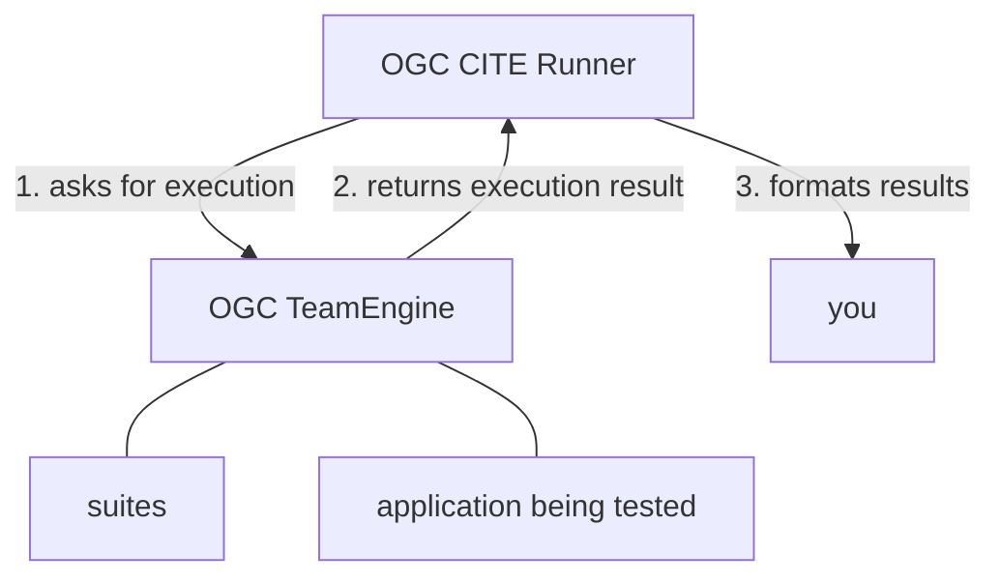

## OGC CITE Runner

A runner for OGC test suites

- Ricardo Garcia Silva <ricardo.garcia.silva@gmail.com>
- Tom Kralidis <tom.kralidis@somewhere.com>


---

## OGC CITE Runner

- OGC CITE Runner is a test runner for OGC CITE test suites
- It is a thin layer of automation over OGC TeamEngine
- Lowers effort required for running CITE tests
- Allows projects implementing OGC standards to have quick feedback on compliance
- Can be run as a standalone tool
- Available as a GitHub Action - also usable on other platforms


---

## OGC CITE

- CITE - Compliance and Interoperability Testing & Evaluation
- Compliance and testing program operated by OGC
- Set of procedures for verifying compliance of an application to OGC standards
- An organization submits an application for CITE
- Compliant applications are granted an OGC Certification Trademark License, certifying that a 
  specific version of a software application complies with an OGC standard
- A large part of the CITE procedure is demonstrating that the application passes OGC test 
  suite for the standard being certified


---

## OGC Test Suites

- Official test suites which are used in the CITE procedure
- Published by OGC


---

## OGC TeamEngine

- Official OGC test runner
- Runs OGC test suites
- Has a web interface
- Official instance hosted by OGC at https://cite.opengeospatial.org/teamengine/
- Open source software
- Can also be run locally via native install or through docker


---

## OGC CITE Runner(1)

- OGC CITE Runner is a thin layer over OGC TeamEngine
- Provides a CLI useful for automating the running of OGC test suites
- Outputs results in multiple formats
- Can be integrated into application CI pipelines
- Allows setting up quick feedback loop between development and possible compliance

---

## OGC CITE Runner(2)




---

## Quickstart(1) - OGC TeamEngine

Start a local instance of OGC TeamEngine:

```shell
docker run \
    --rm \
    --name teamengine \
    --add-host=host.docker.internal:host-gateway \
    --publish=9080:8080 \
    ogccite/teamengine-production:1.0-SNAPSHOT
```

TeamEngine is now available at

    http://localhost:9080


---

## Quickstart(2) - OGC CITE Runner

Install ogc cite runner with `pipx` (or `pip`)

```shell
# install ogc-cite-runner
pipx install ogc-cite-runner

# or with pip
python3 -m venv .venv
source .venv/bin/activate
pip install ogc-cite-runner
```


---

## Quickstart(3) - Application under test

Start the application to be tested, for example the pygeoapi demo server:

    https://demo.pygeoapi.io/master


---

## Quickstart(4) - Use ogc-cite-runner

Use OGC CITE Runner to test your implementation:

```shell
ogc-cite-runner execute-test-suite \
    http://localhost:9080/teamengine \
    ogcapi-features-1.0 \
    --test-suite-input iut https://demo.pygeoapi.io/master
```


---

## Anatomy of an ogc-cite-runner execution

`ogc-cite-runner execute-test-suite` performs three steps in sequence:

1. Asks OGC TeamEngine to run desired test suite;
2. Captures TeamEngine suite execution results in the W3C EARL (Evaluation and Report Language) 
   format (XML-based)
3. Parses results, filtering and converting them into a more human-readable output format


---

## Additional features - output formats

ogc-cite-runner is able to produce results in four different **output formats**:

- console (default) - useful for quick inspection
- json - allows further processing with other tools
- markdown - for embedding into HTML or producing PDF reports
- raw - raw XML in EARL format - useful for two-step workflow


---

## raw output format - two-step workflow (1)

In addition to 

`ogc-cite-runner execute-test-suite` 

there is also 

`ogc-cite-runner parse-result`.

By leveraging the `raw` output format together with the `parse-result` sub-command,
it is possible to break ogc-cite-runner workflows down into two steps:

1. Run the test suite and store the raw XML output
2. Produce a report


---

## raw output format - two-step workflow (2)

```shell
# 1. run the tests and store raw result
ogc-cite-runner execute-test-suite \
    http://localhost:9080/teamengine \
    ogcapi-features-1.0 \
    --suite-input iut https://demo.pygeoapi.io/master \
    --output-format raw \
    > execution-result.xml
    
# 2. generate output
ogc-cite-runner parse-result \
    --output-format markdown \
    execution-result.xml
```


---

## JSON output format example

Using `--output-format json`, ogc-cite-runner can easily be 
integrated into a larger pipeline.

Example: output JSON and then use `jq` to further process results:

```shell
ogc-cite-runner parse-result \
    --output-format json \
    execution-result.xml
| jq '.passed'
```


---

## Additional features - report sections

ogc-cite-runner's output report contains three sections,
which can be toggled:

- summary (on by default)
- failed
- skipped
- passed

```shell
ogc-cite-runner parse-result \
    --with-skipped \
    execution-result.xml
```

---

## Using OGC-CITE-Runner in GitHub actions(1)

- OGC CITE Runner is not published on the GitHub marketplace yet
- You can use it regardless
- just include the action in your workflow

```yaml
jobs:
  demo-ci-job:
    steps:
      - name: "Grab your code and perform whatever setup"
        
      - name: "Launch your application"
          
      - name: "Use ogc-cite-runner GitHub action"
        id: test_ogc_cite_runner_github_action
        uses: OSGeo/ogc-cite-runner@v0.3.0
        with:
          test_suite_identifier: ogcapi-features-1.0
          test_session_arguments: iut=http://host.docker.internal:${{ env.SIMPLESERVER_PORT }}
          
      - name: "Perform whatever cleanup"
```

---

## Using OGC-CITE-Runner in GitHub actions(2)

OGC-CITE-Runner outputs become available in multiple places:

1. In the GitHub actions log (using the `console` output format) - for detailed inspection
2. In the GitHub actions job summary (using the `markdown` output format) - for a quick glance of results
3. As job artifacts (both the `raw` and `markdown` output formats) - if further offline processing is needed
4. As step output (using the `json` output format) - if further workflow-related processing is needed


---

## OGC-CITE-Runner future tasks

- Publish action in the GitHub marketplace
- Option to allow managing TeamEngine execution internally
- Raise awareness for OGC CITE Runner existence
- Become adopted by open source projects that implement OGC standards
  
